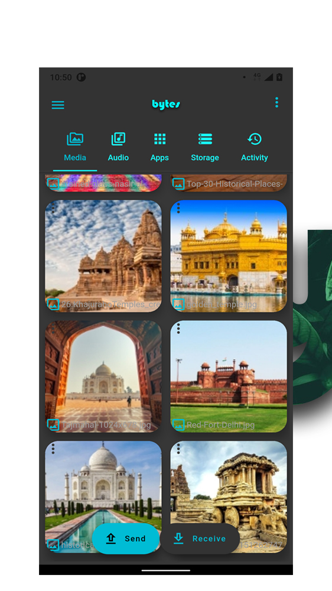
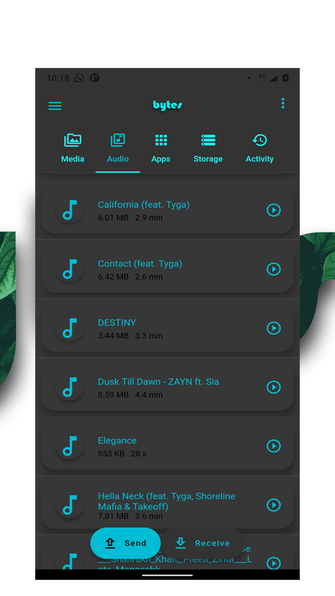
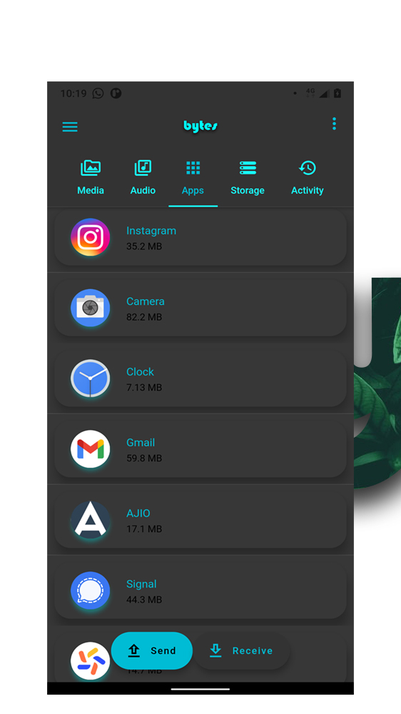
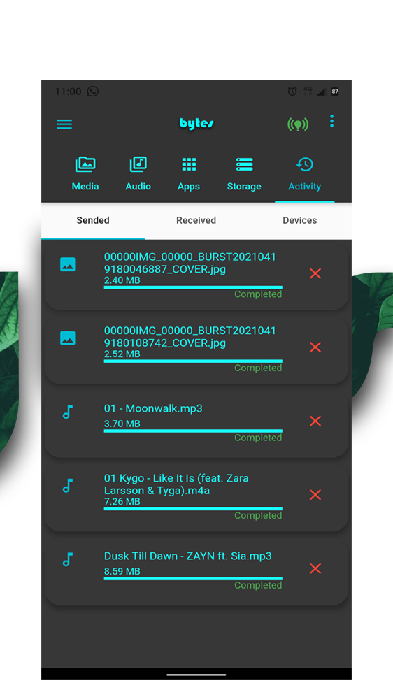
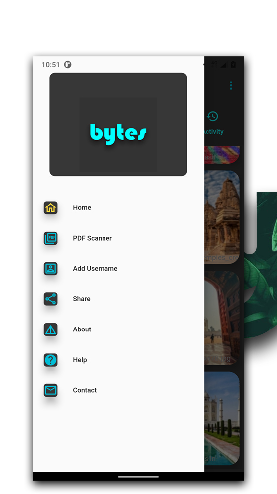

# bytes- File Sharing & PDF Scanner

# Play Store

https://play.google.com/store/apps/details?id=com.devalanrs.bytes
# Buy me a coffee
https://www.buymeacoffee.com/devalanrs

Bytes is a multifunctional tool app. By using bytes you can share files offline.
Bytes - share anything with anyone.
Share music, video, photos, documents, movies, etc.
Transfer all type of files （Application, music, pdf, name, excel, zip, folder）
Main Features
1.Wifi File Transfer
2.PDF Scanner.

Anywhere at any time
Certainly without using mobile data
200 times Bluetooth transfer speed: Top File Transfer Master!
Play audio files before sending.
Open and share apps.
Share large files very quickly.
Access External Storage.

Key features

Transfer files at flash speed
Consider sending your party video and photos to friends in seconds! The maximum speed is up to 40Mb / s.

Send Large Files Without Limit (Original size)
Sharing photos, music, videos, apps, texts, and any other types of Unlimited Size files.

Free Connection and Data
No cables, no internet, no data usage! You can transfer files to friends anywhere and anytime.

Share all types of files without restrictions
Transfer whatever you want, from documents, music, photos, videos, and apps.

More permissions are required !!!
bytes are very focused on transferring nearby files.
To find nearby users and share files properly, bytes require specific permissions such as location, storage, camera, etc.
Please make sure the permissions we have requested are used for file transfers/file sharing ONLY.

If you are experiencing any problems, please feel free to contact us at devalanrs@gmail.com

# Screenshots

## Getting Started

This project is a starting point for a Flutter application.

A few resources to get you started if this is your first Flutter project:

- [Lab: Write your first Flutter app](https://flutter.dev/docs/get-started/codelab)
- [Cookbook: Useful Flutter samples](https://flutter.dev/docs/cookbook)

For help getting started with Flutter, view our
[online documentation](https://flutter.dev/docs), which offers tutorials,
samples, guidance on mobile development, and a full API reference.
